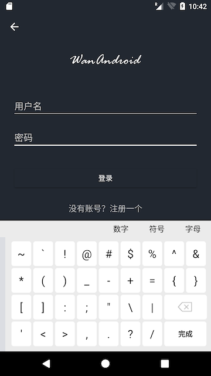
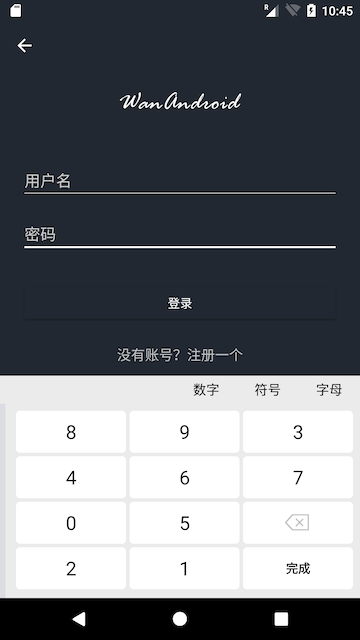

# New Version V1.4     

# LazyKeyboard
A SecurityKeyBoard for Android. Supporting three kinds of keyboard:
Letter, Number, Symbol.

## Installation
### Gradle
**Step 1.** Add following code to your root build.gradle at the end of repositories
```groovy
allprojects {
    repositories {
	...
	maven { url 'https://jitpack.io' }
    }
}
``` 
**Step 2.** Add the dependency
```groovy
dependencies {
    implementation 'com.github.onlyloveyd:LazyKeyboard:v1.4'
}
```

## Basic Usage
**Only Step.** Add **SecurityEditText** into your layout
```xml
   <LinearLayout
        android:id="@+id/container"
        ...">

        <com.gs.keyboard.SecurityEditText
            android:id="@+id/et_security_keyboard"
            android:layout_width="match_parent"
            ... />

        <EditText
            android:id="@+id/et_security_keyboard_two"
            ... />
    </LinearLayout>
```

## Attributes
|Attribute|Usage|
|--|--|
|chooserSelectedColor|the selected keyboard type text color|
|chooserUnselectedColor|the unselected keyboard type text color|
|chooserBackground|the background of keyboard type area|
|keyboardBackground|the background of keyboard |
|isKeyPreview| whether show preview layout when tap on key|

## Custom Keyboard


## Default Keyboard




