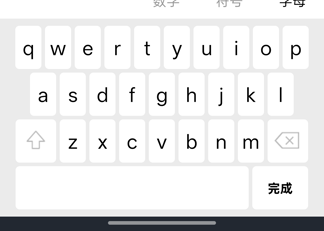
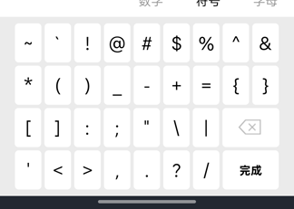
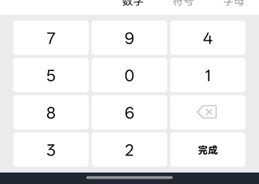
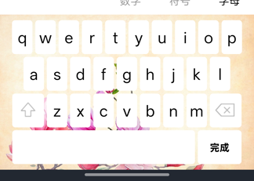

# LazyKeyboard

[](https://github.com/onlyloveyd/LazyKeyboard/actions/workflows/android.yml)
[](https://jitpack.io/#onlyloveyd/LazyKeyboard)
[](LICENSE)
[](https://android-arsenal.com/api?level=23)

**LazyKeyboard** is a lightweight security keyboard for Android. It replaces the system IME on sensitive fields (passwords, PINs, ID numbers…) with an in-app keyboard, so what the user types never passes through a third-party input method.

[中文文档](README_zh-CN.md)

## Preview

| Letter | Symbol | Number (randomized) | Custom colors |
|:---:|:---:|:---:|:---:|
|  |  |  |  |

## Why not the system keyboard?

Any installed IME — including third-party ones with full network access — can read every keystroke typed into a normal `EditText`. For sensitive input, apps in finance, government and healthcare are commonly required to keep input inside the app.

LazyKeyboard shows its own bottom keyboard and inserts characters directly into the field. The system IME is never invoked, and the number pad reshuffles its digits every time it is shown, defeating shoulder-surfing and casual screen recording.

## Features

- **Drop-in usage** — swap `EditText` for `SecurityEditText` in your layout. The keyboard shows on focus and hides on blur; the back key dismisses it.
- **Hard IME block** — the field never creates an `InputConnection`, so no system keyboard can bind to it, not even via long-press selection or explicit `showSoftInput` calls from app code.
- **Anti-cover pan** — if the keyboard would cover the field, the screen content pans up automatically and glides back when the keyboard closes.
- **Three layouts** — letter / symbol / number with a chooser bar, landscape layouts included.
- **Randomized number pad** — enabled by default.
- **Customizable** — chooser colors, chooser and keyboard backgrounds, key preview toggle.
- **Pure Java, small footprint** — no Kotlin runtime required; only AndroidX appcompat + constraintlayout as transitive dependencies.

## Requirements

- minSdk 23, compileSdk 35+
- v1.6 raised minSdk from 19 to 23 (required by AndroidX). Stay on [v1.5](https://github.com/onlyloveyd/LazyKeyboard/tree/28cba58) if you must support Android 5.x.

## Installation

**Step 1.** Add the JitPack repository to your `settings.gradle(.kts)`:

```kotlin
dependencyResolutionManagement {
    repositories {
        google()
        mavenCentral()
        maven(url = "https://jitpack.io")
    }
}
```

**Step 2.** Add the dependency:

```kotlin
dependencies {
    implementation("com.github.onlyloveyd:LazyKeyboard:v1.6")
}
```

## Quick start

Just use `SecurityEditText` wherever the user types sensitive content:

```xml
<com.gs.keyboard.SecurityEditText
    android:id="@+id/login_input_password"
    android:layout_width="match_parent"
    android:layout_height="wrap_content"
    android:hint="密码"
    android:inputType="textPassword"
    app:chooserBackground="@color/iron"
    app:chooserSelectedColor="#000000"
    app:chooserUnselectedColor="#999999"
    app:keyPreview="true"
    app:keyboardBackground="@drawable/keyboard_bg" />
```

That's it — no Java code needed. See the `app` module for a working login-screen sample.

## Attributes

All attributes are optional.

| Attribute | Format | Usage |
|--|--|--|
| `chooserSelectedColor` | color | text color of the selected keyboard type tab |
| `chooserUnselectedColor` | color | text color of the unselected tabs |
| `chooserBackground` | color / drawable | background of the keyboard type chooser bar |
| `keyboardBackground` | color / drawable | background of the keyboard area |
| `keyPreview` | boolean | whether to show the key preview popup when a key is tapped |

## Localization

The default chooser labels (字母 / 符号 / 数字) are library string resources. Override `title_letter`, `title_symbol` and `title_number` in your app to localize them.

## Known limitations

- Built on the framework `KeyboardView`, which Android deprecated in API 29. It still works and will keep working, but it no longer receives fixes or features.
- Because the field rejects all IMEs, IME-driven text composition (and on Android 6–8, clipboard paste via long-press) will not work on `SecurityEditText` — that is the intended security trade-off.
- This is UI-layer protection: it stops IME capture and casual shoulder-surfing. It does not encrypt input or protect a compromised device — for regulated deployments, pair it with your own encryption of the submitted value.

## License

[MIT](LICENSE) © 易冬 (onlyloveyd)
